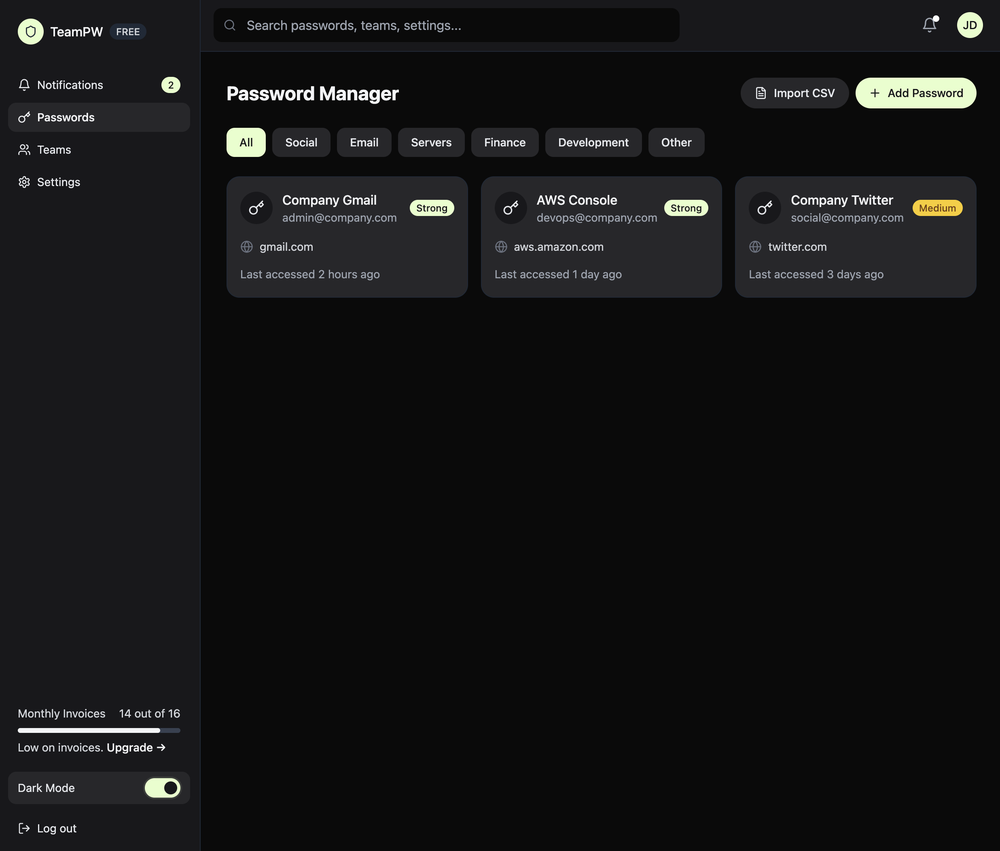
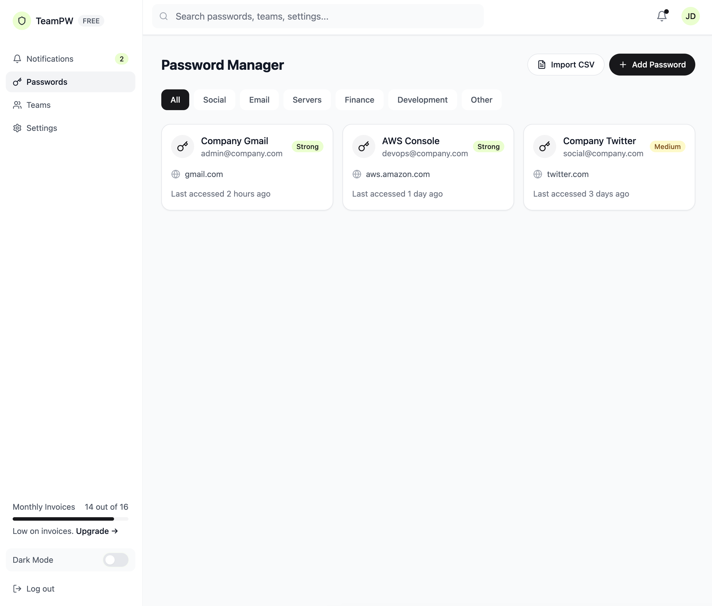

# TeamPW Manager

A modern, secure password manager built with React, TypeScript, Vite, and Supabase. Features a beautiful dark mode interface and comprehensive component system.




## Features

- 🔐 **Secure Password Management**
  - Store and organize passwords
  - Generate strong passwords
  - Custom categories and icons
  - Secure sharing capabilities

- 🎨 **Modern UI with Dark Mode**
  - Beautiful, responsive design
  - Seamless dark/light mode switching
  - Consistent color scheme
  - Smooth transitions

- 👥 **Team Management**
  - Create and manage teams
  - Role-based access control
  - Team password sharing
  - Activity monitoring

- 🔧 **Additional Features**
  - Magic link authentication
  - Real-time updates
  - Multi-step wizards
  - Comprehensive settings
  - Kitchen sink component showcase

## Quick Start

### Prerequisites

- Node.js 18.x or later
- pnpm 8.x or later

### Installation

1. Clone the repository:
```bash
git clone https://github.com/yourusername/teampw-manager.git
cd teampw-manager
```

2. Install dependencies:
```bash
pnpm install
```

3. Create a `.env` file:
```bash
VITE_SUPABASE_URL=your_supabase_url
VITE_SUPABASE_ANON_KEY=your_supabase_anon_key
```

4. Start the development server:
```bash
pnpm dev
```

Visit `http://localhost:5173` to see the app.

## Dark Mode Usage

The app supports system preferences and manual dark mode toggling:

1. **System Preference**: Automatically matches your system theme
2. **Manual Toggle**: Use the theme toggle in the top bar
3. **Persistence**: Theme choice is saved in local storage

### Implementation

```typescript
// In your components:
<div className="bg-white dark:bg-[#27272A]">
  <h1 className="text-gray-900 dark:text-white">
    Hello World
  </h1>
</div>
```

## Component Documentation

### Core Components

#### Button
```typescript
import { Button } from './components/ui/Button';

// Variants
<Button variant="primary">Primary</Button>
<Button variant="secondary">Secondary</Button>
<Button variant="ghost">Ghost</Button>
<Button variant="destructive">Destructive</Button>

// Sizes
<Button size="sm">Small</Button>
<Button size="md">Medium</Button>
<Button size="lg">Large</Button>
```

#### Card
```typescript
import { Card } from './components/ui/Card';

<Card className="p-6">
  <h2>Card Title</h2>
  <p>Card content...</p>
</Card>
```

#### Toggle
```typescript
import { Toggle } from './components/ui/Toggle';

<Toggle
  checked={isDark}
  onChange={setIsDark}
/>
```

### Feature Components

#### CreatePassword
```typescript
import { CreatePassword } from './components/passwords/CreatePassword';

<CreatePassword onClose={() => {}} />
```

#### TeamManagement
```typescript
import { TeamManagement } from './components/teams/TeamManagement';

<TeamManagement />
```

## Color Scheme

### Light Theme
- Background: `white`
- Text: `gray-900`
- Accent: `#18181B`
- Border: `gray-200`

### Dark Theme
- Background: `#27272A`
- Text: `white`
- Accent: `#E5FFCA`
- Border: `transparent`

## Contributing

We welcome contributions! Here's how you can help:

1. **Fork the Repository**
   - Create a personal fork
   - Clone locally

2. **Create a Branch**
   ```bash
   git checkout -b feature/your-feature-name
   ```

3. **Make Your Changes**
   - Follow the existing code style
   - Add tests if applicable
   - Update documentation

4. **Commit Your Changes**
   ```bash
   git commit -m "feat: add new feature"
   ```
   Follow [Conventional Commits](https://www.conventionalcommits.org/)

5. **Push and Create a PR**
   ```bash
   git push origin feature/your-feature-name
   ```
   Then create a Pull Request on GitHub

### Development Guidelines

1. **Code Style**
   - Use TypeScript
   - Follow ESLint rules
   - Use functional components
   - Implement proper types

2. **Component Guidelines**
   - Keep components small and focused
   - Use composition
   - Implement proper prop types
   - Support dark mode

3. **Testing**
   - Write unit tests for utilities
   - Add component tests
   - Test both themes

## License

MIT © Jordan Metzner @ Ryz Labs 

## Acknowledgments

- Built with [Vite](https://vitejs.dev/)
- UI Components from [Radix UI](https://www.radix-ui.com/)
- Icons by [Lucide](https://lucide.dev/)
- Backend by [Supabase](https://supabase.com/)
